# The Silent Invasion

### The Problem
I know at least three people who have lost their homes to fire season in this part of Portugal.

It never used to be this way, but invasives have a way of becoming permanent additions to an ecosystem, and we’ve got to learn how to live in harmony with them.

The problem with eucalyptus — or _fire trees_, as they’re known in their native Australia — is that they have no natural predators here. Their resinous tissue repels all but the cuddly koala, and we’ve got none of those around to make a dent. About **26% of Portuguese forests** have been conquered by _Eucalyptus globulus_. The ground beneath them is bare. Nothing grows. Where there should be cork oaks, stone pines, and strawberry trees humming with life, there is silence. 

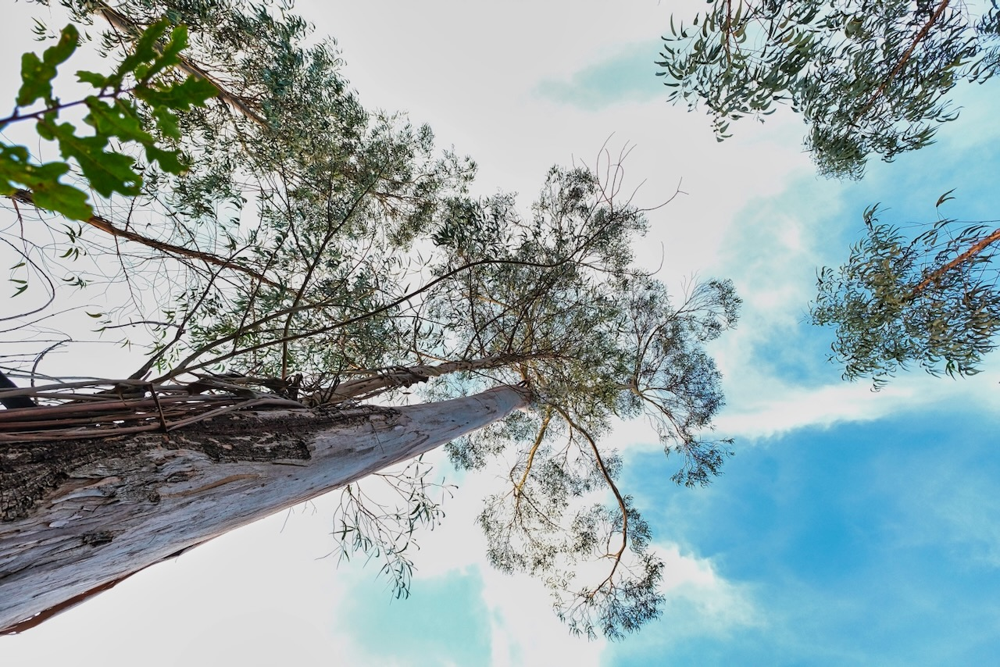
*Tall* Eucalyptus globulus *on a Portuguese hillside. The species evolved in Australia to encourage fire — here, with no native predators and 26% of forest cover already taken, it's doing exactly that.*

	The Eucalyptus Problem
	- Drinks **20-30 liters of water per day** (stolen from the watershed)
	- Releases allelopathic chemicals that poison other plants
	- Drops volatile oil-rich bark that turns landscapes into tinderboxes
	- Acidifies soil and destroys beneficial microbes
	- Creates biological deserts where rich ecosystems once thrived

Every fire season leaves behind charred stone ruins of homes that used to be, homes that need rebuilding. And the rebuilding of a charred home can quickly bankrupt a family. Where are they going to stay during the multi-year process? Whole families stuck together in a cold camper trying to survive wet winters while they rebuild with expensive and toxic manmade materials.

---

## Two Problems, One Dome

But there’s another predator afoot with an insatiable appetite that just needs to develop a taste for eucalyptus flesh. The widespread fires are in part responsible for this herbivore’s arrival — every fire season creates demand for rebuilding.

If only we could solve two problems with one dome. How do we unleash the insatiable predator of home construction against the very trees that are destroying our homes? And how do we selectively target their young so that they stop coming back?

**The solution exists already in the heart of the problem.**

We find a way to construct quick, easy, and cheap structures from young flexible eucalyptus poles — in a way that doesn’t resist the euc’s natural tendency to twist as it dries. Enter the **Regenerative BioDome Project**, a regenerative experiment happening at Agua Lila. 

	This Project Is
	90% ecological restoration, 10% building project. 
	You’re not just constructing a home. 
	You’re healing a watershed, preventing wildfires, enabling native forest regeneration, and demonstrating that restoration can create real value.

## What If Removal Created Value?
What if the act of removing invasive species produced something valuable? What if watershed healing could be economically viable? What if “waste” biomass became functional architecture?

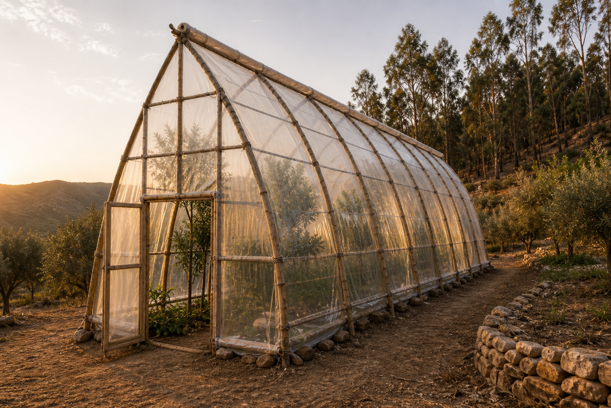
*The intended structure at Templo da Água Lila — six gothic arches, twin parallel ridge poles, two off-the-roll plastic sheets meeting at the apex with a 30cm slot of open sky along the spine.*

The answer — after a lot of sketches and a lot of math — is that it wants to bend into a tall, narrow gothic arch. Eight metres of pole, butt in a posthole, thin end pulled inward and upward to meet its partner at a sharp point 6.5 metres overhead. Six of those arches in a line, two parallel ridge poles along the apex, plastic over the whole thing, and you have a tunnel tall enough for citrus.

That's the design I'm writing about today. The **Gothic Arch Greenhouse** — the first proof-of-concept structure we're raising at **Templo da Água Lila**, and the answer to a question I'd been carrying for a couple of years: *can we grow tropical fruit trees in the mountains of central Portugal?*

---

## Why Gothic

The pointed arch isn't an aesthetic flourish. It solves three real problems at once.

**It goes tall.** A round-topped (Romanesque) arch wants to spread its load sideways, which is why those old churches have such thick walls. A gothic arch throws the load up the ribs and back down the verticals — meaning a much taller, narrower profile is structurally honest. Our footprint is only 3 metres wide, but the apex sits **6.5 metres above the ground**. A semi-dwarf grapefruit clears the centre easily. A standard banana plant just fits. Papaya is in its element.

**It vents through the spire.** A 6.5m apex is plenty of vertical height to drive **stack-effect ventilation** — hot air rises, exits at the top, pulls cool air in low through the doors and roll-up walls. No fans. No electricity. Just geometry doing its work. (More on the trick that makes this work in a moment — the apex is split open along its full length.)

**It catches light from above.** A tall narrow profile means sunlight reaches the leaves from a much higher angle through the day. Tropical-feeling plants — citrus, banana, dragon fruit on wires — *want* that overhead light.

The fourth, quieter benefit is that long-pole eucalyptus actually *prefers* this shape. The arch only flexes meaningfully in its top third — most of the pole stays close to vertical, then bends sharply inward to meet its partner at the apex. Think of it less as a deep arch and more as a tilted spire. The poles don't have to fight to hold the form.

If you've spent time around old greenhouses, you've probably seen the cheaper round-topped tunnels. They overheat in summer and crush plants in winter snow. The Gothic Arch fixes both at once: better summer breath, steeper roof for shedding rain and snow, more headroom for trees that want to grow up.

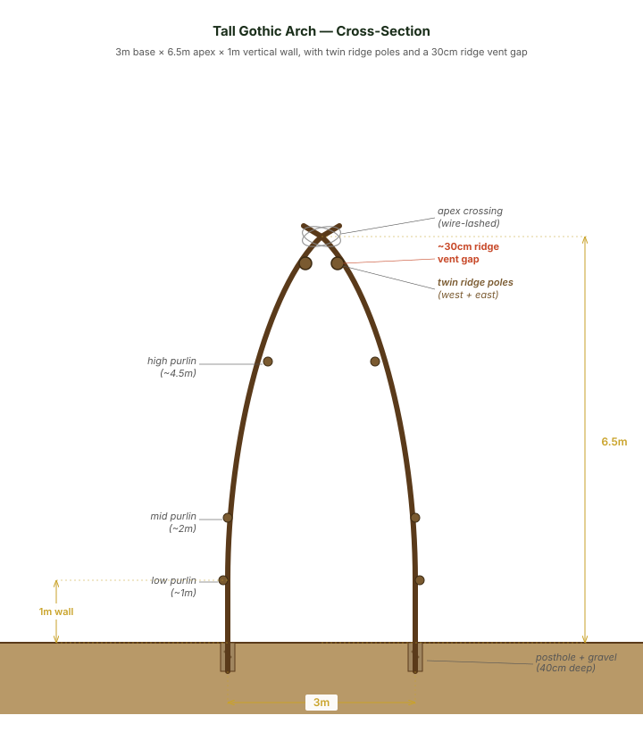
*Cross-section: 6.5m apex over a 3m base. Twin parallel ridge poles 30cm apart at the apex create the continuous vent gap that runs the full length of the structure.*

---

## What You're Actually Building

Picture a rectangle on the ground, 3 metres wide and 10 metres long. Two parallel rows of six gravel-filled postholes, 2 metres apart along the length.

Out of each posthole rises one half of an arch — a long, freshly-harvested *Eucalyptus globulus* pole, 8 metres long, 9–11 cm thick at the base. There are six pairs total, six gothic arches, each one made of two poles meeting at a sharp point 6.5 metres overhead and overlapping by 30–40 cm.

Running the full length of the tunnel along the apex are *two* parallel ridge poles, lashed to the outsides of the arch crossings, separated by about 30 cm of vertical gap. That gap matters — it's the **continuous ridge vent**, and it runs the entire 10-metre length.

Six longitudinal purlins span between the arches — three per side, at hip, shoulder, and just-below-apex height — locking the structure into a single rigid skeleton.

Both gable ends are framed with door posts and infill poles. Each gable holds a doorway opening 80 cm wide.

Then the skin: **two off-the-roll 8m × 10m sheets of 150-micron UV-stabilised polyethylene** — one per slope. Each sheet is lashed to *its own* ridge pole at the top, never touching the other. So the apex has two anchored edges of plastic with a 30 cm slot of open sky between them.

A separate **vent cap** — a 1m × 11m strip of plastic — is hinged to the west ridge pole and drapes over the gap. Weight its loose edge onto the east sheet to seal in winter. Prop it up with sticks to open in summer. Three climate modes fall out of this naturally: *sealed* (passive solar, vent shut, walls down — winter), *mild* (vent propped, walls rolled to first purlin, doors open — spring/autumn), and *hot* (vent fully open, walls fully raised, doors open — peak summer; the structure becomes essentially a shade roof on legs).

That's the whole thing. Twelve postholes. Six arches. Two ridges. Six purlins. Two big sheets and a vent cap. A door at each end.

It costs **€100–300** in bought materials if your eucalyptus is free — which, if you're clearing invasives off your own land, it is. It takes **three days to raise**, after one to two weeks of pole preparation. Two strong adults can do most of it; a third person is genuinely useful on raising day, because the long arches are at the limit of two-person handling.

---

## Sized Around the Sheet

A small note for the engineering-minded among you, because this is one of the parts I'm proud of.

The whole tunnel is sized around the dimensions of a single off-the-roll plastic sheet: **8 metres by 10 metres**, the standard sheet you can walk into any *agro-pecuária* in Portugal and buy.

- The **8-metre dimension** is the drape distance per side: ground anchor, up a 1m vertical wall, around the curve, over the ridge pole at the apex, with about 50 cm of slack for fold and anchor.
- The **10-metre dimension** is the tunnel length itself, gable to gable.

Two sheets — one per slope — cover the entire structure with no waste, no seams along the slope, no patching. This is the cheapest way to get plastic over a structure, and the geometry of the tunnel was reverse-engineered from it.

If your sheets are a different size, the apex height scales by Pythagoras. For a tunnel of width *w* with vertical wall height *w* and apex height *h*, the drape per side comes out to roughly *w* + 1.1·√(1.5² + (*h* − *w*)²) + 50 cm of anchor and fold. You can build this thing at almost any size — what's documented is just the version that fits the most common roll.

That's the whole "design philosophy" of this greenhouse: *the cheapest cathedrals are the ones that fit the materials the world already makes.*

---

## The Build, in Three Days

The hard part isn't the construction. It's the pole preparation that comes before it.

### Before the build weekend — preparing the poles

Tall arches need *long, stiff* poles. You want older eucalyptus — 8 to 12 years old — with straight, larger trunks. The younger 5–8-year-old material that bends easily into a wattle fence is too whippy at 8 metres. You need fourteen arch poles (twelve, plus two spares), four ridge poles, twelve purlin poles, about a dozen smaller gable infill poles, and four door posts.

The treatment recipe at Água Lila is deliberately simple, and worth a paragraph of its own.

The conventional protocol for buried eucalyptus in Portugal is char + borax soak + linseed oil — that gets you 30–40 years of service life, and it's the right call for a permanent dwelling where the poles will be encased in cob and a living roof. But this is a *greenhouse*. The plastic skin lives on a 3–4 year cycle, the frame is fully accessible, and pole replacement at year 15 or 20 is tractable rather than catastrophic.

So I've designed this build around what I'm calling the **Regenerative Default**: char the bases, skip the borax bath, seal everything with linseed oil. No industrial chemicals. No five-day soaking trough. Roughly 15–20 years of pole life from charring alone, with linseed oil reapplied every 5–10 years (easiest during a plastic re-skin year) doing the above-ground preservative work that the borax would have done from inside the wood. If your site has heavy termite or beetle pressure — lower elevation, coastal Portugal — or you simply want the longer service life, the Extended-Life Protocol with the borax soak is documented in the [Treatment Guide](https://biodome.agualila.earth/fundamentals/03-treatment/) on the official site. Choose accordingly.

Once cut, every pole needs to be:

1. **Debarked within 48 hours.** Bark left on traps moisture and accelerates rot. Strip with a drawknife or flat-blade scraper, working butt to thin end.
2. **Charred at the base to 8–10 mm depth.** Torch the bottom 50 cm of every arch pole over a fire until the char layer reaches alligator-scale cracking — that's the visible signal you've gone deep enough. Brush off loose char with a stiff wire brush. The carbonised layer is your primary defence in the buried section: it carries no nutrient value for fungi or insects, and creates a hydrophobic barrier in the most rot-vulnerable zone of the pole. This is the step that does most of the work.
3. **Scored along the bending zone.** Shallow cuts every 10 cm on the outer face of the upper half of each arch pole — the face that ends up on the outside of the curve. The scoring relieves tension in the outer fibres so the pole bends *smoothly* into shape rather than cracking.
4. **Sorted and paired.** Sort all fourteen arch poles by butt diameter and pair them so each arch has two poles of similar size (six working pairs plus one spare). Both butts in each pair sit at ground level — one in the left row, one in the right — so taper matching across the apex matters for a balanced apex crossing.

By the time the first pole hits the first posthole, it's been changed: deeply charred at the base, scored and ready to flex. You're not just standing trees up. You're standing up trees that have been prepared for the work.

(The linseed oil sealing comes *after* the frame is up and dry — that's a Day 4 task, not a prep task. More on that at the end.)

### Day 1 — Foundation

Mark a 3m × 10m rectangle on a roughly level patch. Check the diagonals — both should measure 10.44 metres. Adjust until they match.

Run two strings between the corner stakes along the long sides. Mark each string at 0, 2, 4, 6, 8, and 10 metres. Twelve posthole positions, six in each row.

Each hole goes **40 cm deep, 25 cm wide**. The taller arches transmit more horizontal kick at the base than a shorter structure would, so the holes are dug deeper than your usual fence post — and the gravel bed at the bottom matters. If your soil is clay-heavy or waterlogged, go to 50 cm with extra gravel.

Drop a flat stone at the bottom of each hole, then 20 cm of gravel as a drainage bed. The pole butt sits on this; more gravel packs around it once the frame is up.

At each gable end, set two vertical 9–11 cm posts into postholes 80 cm apart, lash a horizontal crosspiece at about 2.1 m height — that's your door frame.

Drive a long ground stake (80 cm rebar or hardwood) vertically into the ground 25 cm outside each of the 12 arch postholes. These are the tie-down points the arches will eventually be wire-lashed to, against wind uplift.

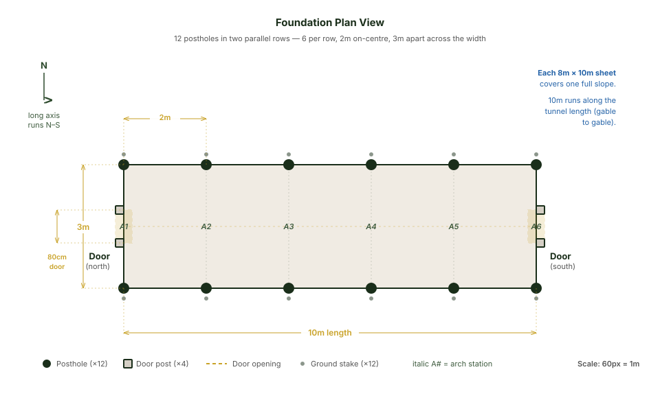
*Foundation plan: 12 postholes in two parallel rows — 3m apart across the width, 2m on-centre along the 10m length — with door frames at both gable ends.*

Day 1 ends with twelve points where the Earth has agreed to receive the structure, plus two doorways waiting for arches.

### Day 2 — The day the frame stands up

This is the physical day. The arches are 8 metres long and they reach to 6.5 metres at the apex. You're going to be on a 3-metre stepladder. Plan for a full day. Make sure a third person is around.

Take the first pair of poles. Set one butt into the corner posthole on the left row. Three people walk it up: two pushing it vertical from the base, a third pulling the thin end with a rope. Once it's vertical, you slowly bend the top third inward toward the centreline.

Take the second pole of the pair. Set its butt into the matching posthole on the right row, 3 metres across. Walk it up the same way. Bend it toward the first pole until the two thin ends meet at the apex, roughly 6.5 metres above the centreline of the rectangle, overlapping by 30–40 cm.

Lash the overlap tight with at least four full wraps of galvanised wire. Brace the arch with two diagonal props (any straight pole 4m+ long) wedged from the ground up to the wall–curve transition, about 1m up each side. Without bracing, a single tall arch is unstable.

Move 2 metres down the tunnel and raise the second arch the same way.

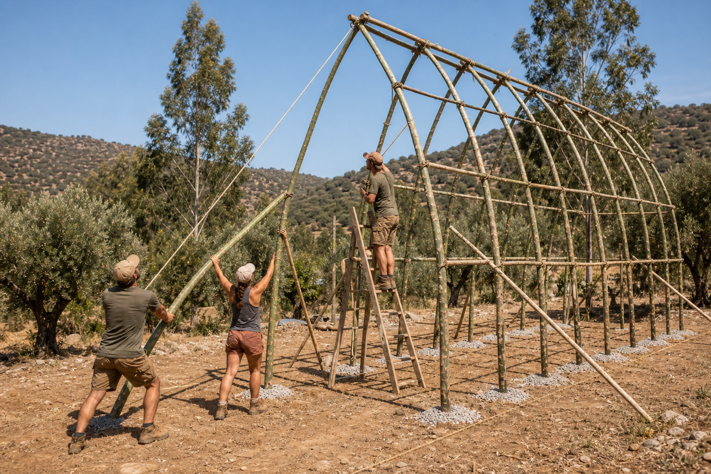
*Mid-morning on Day 2 — walking the second pole of an arch up out of its posthole, bending its top third inward toward its partner already waiting at the apex.*

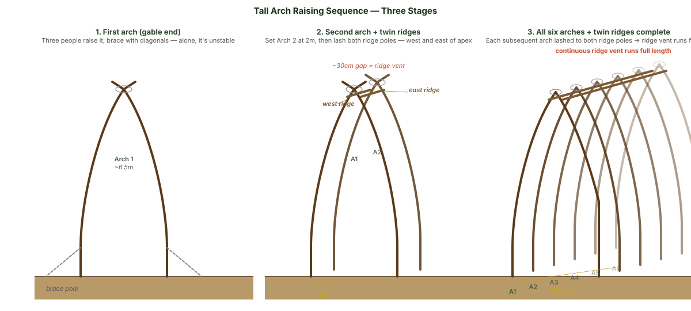
*Raising sequence: brace the first arch with diagonal props; set the second arch and connect with twin ridge poles; then add the remaining four arches with the ridges keeping the structure aligned along its length.*

Now comes the move that makes this design work — **the twin ridge poles**. Lift the first ridge pole (5.5 m long, 7–9 cm thick) onto the *west* side of the apex crossings of arches 1 and 2, sitting in the V about 30 cm before the very top. Lash to each apex crossing with galvanised wire. Then lift the second ridge pole onto the *east* side of the same crossings, 30 cm past the apex. Lash both. The two ridges are now parallel along the length of the tunnel, separated by a continuous 30 cm vertical gap.

That gap is the whole ventilation strategy. A single ridge pole down the centre would force you to seal the apex with tape — and a sealed 6.5m apex turns into a chimney that boils plants on hot days. The twin ridges are *both* structural (they turn the arches into a truss along the length) and climatic (the gap is the safety valve).

Once the twin ridges are in, the first two arches become rigid and you can remove the temporary diagonals. Raise arches 3, 4, 5, and 6 at 2-metre spacing, lashing each new apex crossing to both ridges as you go. Overlap a second pair of ridge poles past arch 4 and continue to arch 6.

Then the **purlins** — six longitudinal poles, three per side, lashed to the outside face of every arch at hip height (~1m), shoulder height (~2m), and below-apex (~4.5m). The upper purlin is genuinely high; bring the stepladder.

Frame the gable triangles last. They're big — about 14m² each — so they need infill poles (a vertical from the door lintel up to the apex, plus diagonals from the door posts up to where the gable arch starts to curve) to break the triangle into manageable bays.

By sunset of Day 2, the bones of the tunnel are standing on the hill. It looks like a long, narrow skeleton of a ship pointing at the sky. Push on it from the side — it should flex slightly, but not rack.

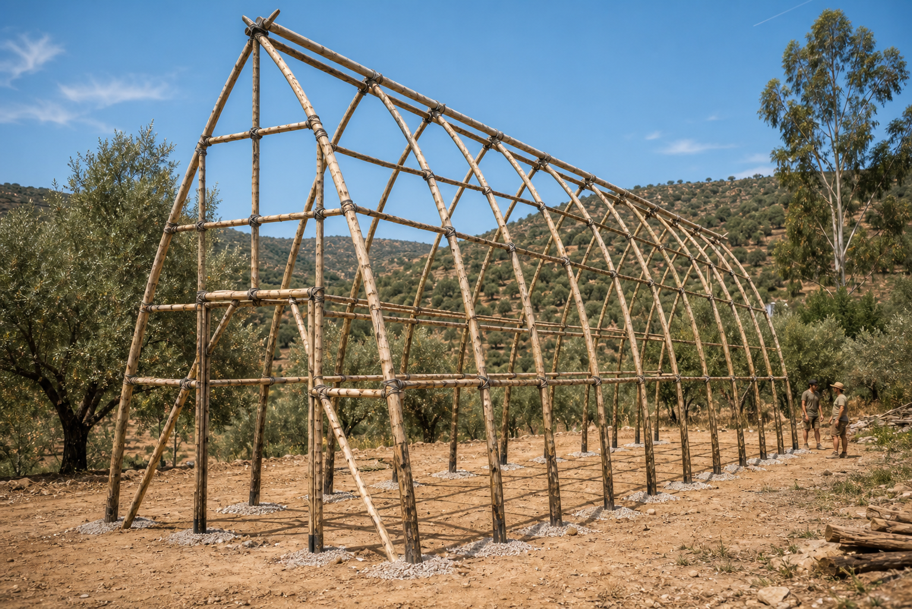
*The bones at the end of Day 2. Six gothic arches, twin ridge poles, six purlins, gable framing — all the structural work done, ready for skin.*

### Day 3 — Skin

Pick a calm day. Wind makes draping plastic miserable.

Roll out the first 8m × 10m sheet flat on the ground next to the west side of the tunnel, 10m direction parallel to the tunnel length. Two people lift the long upper edge up to the **west ridge pole**, drape the sheet down the slope, fold the top 30 cm of plastic over the pole and back onto itself, and lash that fold to the pole every 50 cm. The plastic is now clamped between itself and the ridge.

Repeat on the east side with the second sheet. The two sheets now both anchor at the apex, but they don't touch. There's a continuous 30 cm gap of open sky between them.

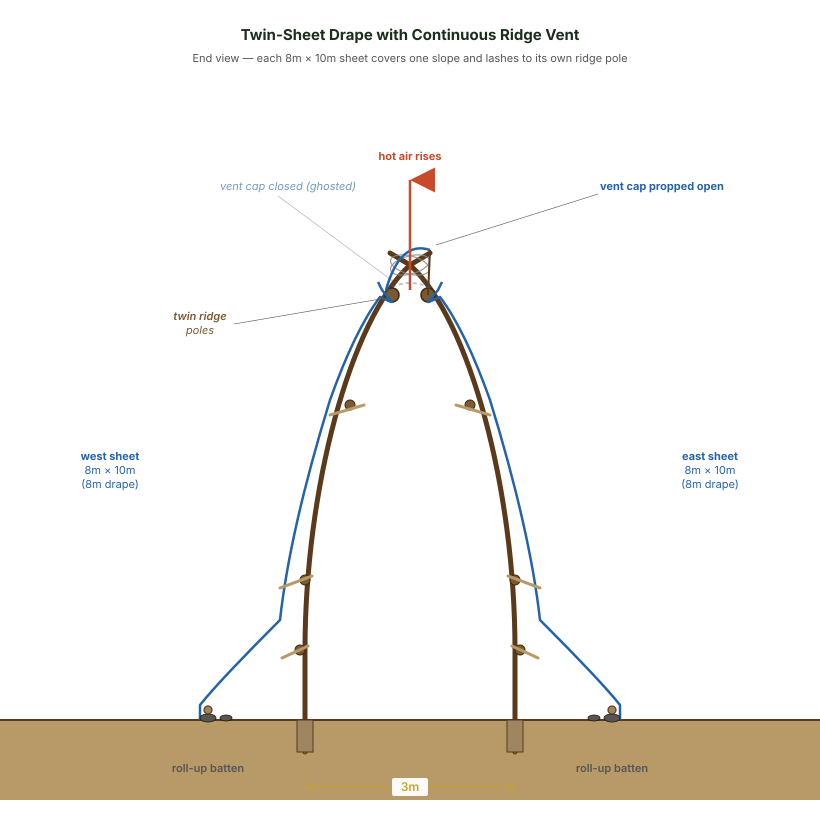
*Twin-sheet drape: each sheet covers one slope, lashed to its own ridge pole. The 30cm gap between ridges is the ridge vent, covered by a hinged vent cap.*

At each of the six purlin lines, lay a split-pole batten over the plastic on the outside, pressing it against the purlin underneath, and lash batten-to-purlin with twine. This is the **sandwich method** — no punctures in the plastic.

For the long base edges, use the **roll-up method**: wrap each base edge of plastic around a long thin pole (a 5m batten works), then weight the pole on the ground with stones. Lift to ventilate. Drop to seal.

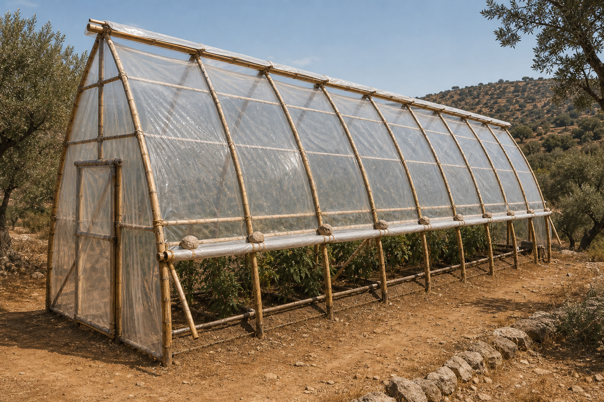
*Side view with the skin on. Roll-up walls down for cool conditions; lift them to first purlin in mild weather, all the way up in peak summer.*

Take the **vent cap** — a 1m × 11m strip cut from offcuts or a third small sheet — and lash one long edge to the west ridge pole along its full length, on top of the west sheet's clamped fold. The cap drapes across the apex and overlaps onto the east sheet by about 20 cm. To close the vent, weight the loose edge of the cap onto the east sheet (small stones, or stones tied into a fold). To open it, prop the cap up with 30–50 cm sticks at intervals along the length. The cap lifts to create a continuous slot vent — hot air escapes upward and out, cool air gets pulled in low through the doors and roll-up walls. The 6.5 metres of vertical pull is enough to drive strong airflow even on a still day.

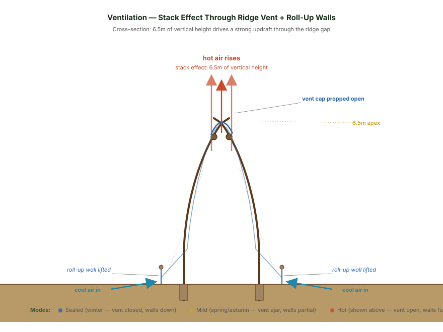
*Ridge vent operation: cap propped open creates a continuous 10m slot vent. Hot air rises and exits through the gap; cool air is drawn in low through the doors and roll-up walls. The 6.5 metres of vertical pull drives strong airflow even on still days — no fans, no electricity.*

Cover the gable triangles with whatever cladding you have — UV plastic, shade cloth, scrap tarp. Tape the seams where gable cladding meets the main slope sheets. Frame the doors as tape-reinforced flaps weighted at the bottom with thin poles.

Three days, and you have a 30-square-metre tunnel with a 6.5-metre apex standing on what used to be a stretch of hillside in the way of growth.

### Three weeks later — the linseed cure

The poles you put in the ground are still wet. Wait two to three weeks for the structure to dry in place — the wood fibres lock into the curved shape as moisture content drops, and your lashings will need re-tightening as the eucalyptus shrinks 4–8% radially.

Once the poles are dry (under 15% moisture if you have a meter), heat raw linseed oil to 60–70°C and brush it onto every above-ground pole surface. The oil hardens over a couple of days and waterproofs the wood while staying breathable. This step is doing real work on the Regenerative Default protocol — it's the *outside* preservative that the borax soak would have done from the *inside*. Reapply every 5–10 years; the easiest moment is during a plastic re-skin year, when the frame is fully exposed anyway.

That's the whole maintenance contract: char the bases once at the start, linseed everything every plastic cycle. No chemicals, no soaking trough, no five-day prep window. *Fire and oil from the flax plant.*

---

## What Actually Grows in It

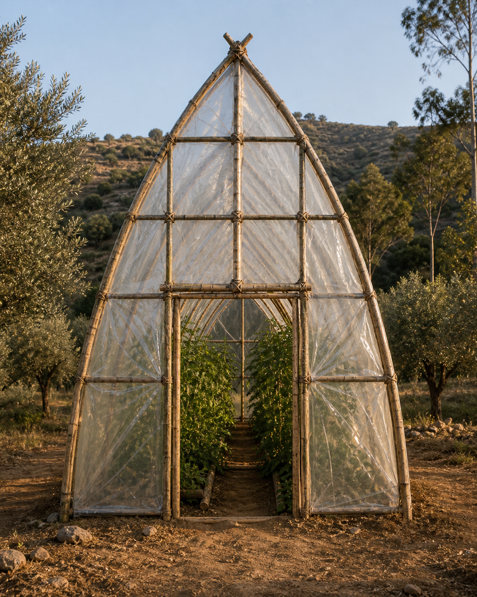
*Looking in through the gable door. The sharp gothic profile is the entire point — the volume that opens above the doorway is what makes tropical fruit possible.*

The whole point of going tall is the planting palette.

Down the centre, in the highest-volume zone, go **citrus**: semi-dwarf grapefruit, mandarin, lemon, lime — all comfortable, with annual pruning. They'll clear the apex with growing room, and a standard kumquat or Meyer lemon disappears into the volume entirely. **Banana** does well in this profile too — Dwarf Cavendish (2–3m) thrives, and standard banana (4–5m) just fits. **Papaya** is the easiest of all: it naturally fruits at 2–4m, exactly suited to this height.

Along the sides, in the 2–4 metre zone, plant medium fruit — fig, smaller citrus, espaliered stone fruit if your winters are mild enough.

At the wall edges, where the curve pulls down to a metre of vertical wall, run ground crops — greens, herbs, strawberries — that don't need height.

Across the apex, run wires from the high purlin on one side to the high purlin on the other to make a 4–5 metre trellis. **Climbing vines** love this: passion fruit, kiwi, dragon fruit, climbing tomatoes. They'll fill the volume above your head and turn the upper third of the tunnel into a productive canopy.

That's three productive zones in 30 square metres. A vertical food forest under plastic. Tropical fruit on a Portuguese mountainside. Eucalyptus turning into citrus, banana, and dragon fruit.

---

## Where This Is Being Tested

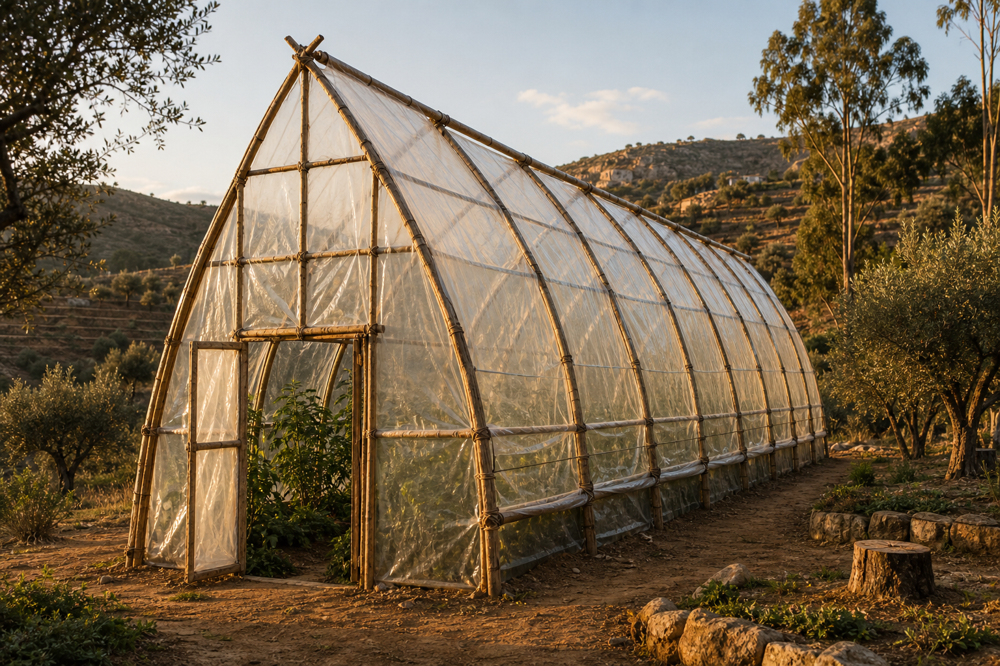
*The Gothic Arch at* Templo da Água Lila *— first proof-of-concept, sited on the slopes of an abandoned canyon valley in the* Montanhas Mágicas *of central Portugal.*

**Templo da Água Lila** is our family's regenerative sanctuary in the *Montanhas Mágicas* of central Portugal. When my wife and I bought the land, the hillsides were choked with invasive eucalyptus drinking the springs dry. The first decision was to start cutting and start planting. Native forests dotted with exotic fruit trees and berry bushes. *We cut and we plant.*

The Gothic Arch Greenhouse is the **firstborn** of a wider design family I've been developing — the first one stepping off the drawing board and into soil. The siblings are still concepts: a smaller circular [Greenhouse BioDome](https://biodome.agualila.earth/greenhouse/01-build-guide/) (a 6m dome, the simplest expression — a weekend and under €300), a [Standard BioDome](https://biodome.agualila.earth/standard-biodome/01-overview/) (a wattle-and-cob permanent dwelling with a living roof), and an [Earth-Sheltered SolarPod](https://biodome.agualila.earth/earth-sheltered/01-overview/) cut into a south-facing slope with Da Vinci bridge rafters spanning the opening. All design-stage. The Gothic Arch is the one we're actually raising.

All of them are open-source. Every measurement, every diagram, every Portuguese supplier name (*agro-pecuária* for plastic, *ferragem* for wire, *britagem* for gravel) is published under Creative Commons BY-SA 4.0. Free to use, fork, translate, redistribute. Architecture has always been open source — we're just remembering.

If you'd like to build this thing, the full Gothic Arch Greenhouse build guide is here:

> 📐 [**The Gothic Tunnel Greenhouse — Official Build Guide**](https://biodome.agualila.earth/gothic-greenhouse/01-build-guide/)

It has every spec, every figure, the full bill of materials, the Pythagorean scaling formula for non-standard sheet sizes, the maintenance schedule, and the orientation notes (north–south long axis is the right choice for a tall tunnel like this).

---

## A Note on Limits

Three honest caveats before you start.

**Wind.** Tall narrow tunnels catch a lot of wind on the broadside. Site this thing in a sheltered location, or behind a windbreak. Orient the long axis parallel to your prevailing wind so storms hit the gable end, not the broadside.

**Plastic budget.** Two main sheets plus vent cap plus gable cladding works out to about €100–190 in plastic every 3–4 years. UV-stabilised polyethylene is good for that long in Portuguese sun, no longer. Replacement is a two-person, full-day job.

**Pole replacement.** When an 8-metre arch pole eventually fails — roughly 15–20 years on the Regenerative Default protocol, 30–40 years on the Extended-Life Protocol — swapping it is a real undertaking. You'll likely have to lift one end of the tunnel to get the old pole out and the new one in. Char the bases properly *now* and don't let your linseed reapplications lapse, and that day stays as far out as possible.

This is still a plastic-skinned greenhouse, not a four-season living space. Winter nights drop close to outdoor temperatures inside. It's a tropical fruit chamber and a season-extender, not a heated room.

---

## What This Is Really For

If you have eucalyptus on your land, you have all of this for free: the poles, the volume, the stack vent, the food forest under plastic.

The trees come down whether you build with them or not — fire season decides that for you. The question is whether they end up burned and trucked out, or charred at the base and lashed into shape, doing one more useful thing on their way back to the soil.

Everything in this design exists to answer that question with the cheapest, most beautiful answer I could find. A 30-square-metre tunnel, six gothic arches woven from the trees that should not have been there, two off-the-roll plastic sheets, three days of work, and a continuous 30-centimetre slot of open sky along the apex doing all the breathing for you.

If you build one, send photos. If you fork the design and improve it, push it back. If you translate the guide into Portuguese or Spanish, even better.

The hillside the trees are coming off was abandoned. The tunnel they go into shouldn't be.

In Love and Service,

— **Dr. Truman**
*Templo da Água Lila*

🌿 ⛩️ ◈

---

*#MythsForANewÆon  #BioDome  #AguaLila  #GothicArchGreenhouse  #OpenSourceArchitecture  #Eucalyptus  #Regeneration*
