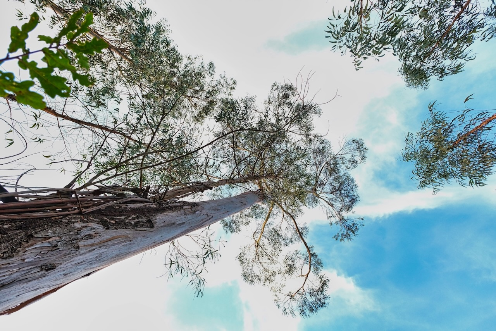

import { Card, CardGrid } from '@astrojs/starlight/components';

The Problem

## The Silent Invasion

I know at least three people who have lost their homes to fire season in this part of Portugal.

It never used to be this way, but invasives have a way of becoming permanent additions to an ecosystem, and we've got to learn how to live in harmony with them.

The problem with eucalyptus — or *fire trees*, as they're known in their native Australia — is that they have no natural predators here. Their resinous tissue repels all but the cuddly koala, and we've got none of those around to make a dent. Across **26% of Portuguese forests**, over 800,000 hectares have been conquered by *Eucalyptus globulus*. The ground beneath them is bare. Nothing grows. Where there should be cork oaks, stone pines, and strawberry trees humming with life, there is silence.

:::danger[The Eucalyptus Problem]
- Drinks **20-30 liters of water per day** (stolen from the watershed)
- Releases allelopathic chemicals that poison other plants
- Drops volatile oil-rich bark that turns landscapes into tinderboxes
- Acidifies soil and destroys beneficial microbes
- Creates biological deserts where rich ecosystems once thrived
:::

Every fire season leaves behind charred stone ruins of homes that used to be, homes that need rebuilding. And the rebuilding of a charred home can quickly bankrupt a family. Where are they going to stay during the multi-year process? Whole families stuck together in a cold camper trying to survive wet winters while they rebuild with expensive and toxic manmade materials.

## Two Problems, One Dome

But there's another predator afoot with an insatiable appetite that just needs to develop a taste for eucalyptus flesh. The widespread fires are in part responsible for this herbivore's arrival — every fire season creates demand for rebuilding.

If only we could solve two problems with one dome. How do we unleash the insatiable predator of home construction against the very trees that are destroying our homes? And how do we selectively target their young so that they stop coming back?

**The solution exists already in the heart of the problem.**

We find a way to construct quick, easy, and cheap structures from young flexible eucalyptus poles — in a way that doesn't resist the euc's natural tendency to twist as it dries. Enter the **Regenerative BioDome**.

:::note[This Project Is]
**90% ecological restoration, 10% building project.** You're not just constructing a home. You're healing a watershed, preventing wildfires, enabling native forest regeneration, and demonstrating that restoration can create real value.
:::

The Solution

## What If Removal Created Value?

What if the act of removing invasive species produced something valuable? What if watershed healing could be economically viable? What if "waste" biomass became functional architecture?

<figure>
  
  <figcaption>Interior spaces designed around natural light and living materials</figcaption>
</figure>

  

    1
    <h3>Heal the Land</h3>
    
Remove 50-200 invasive trees, returning thousands of liters of water daily to the watershed while eliminating wildfire fuel.

  

  

    2
    <h3>Build From Waste</h3>
    
Transform removed eucalyptus into a permanent, fire-resistant structure using natural materials—light straw-clay walls, living roof, zero concrete.

  

  

    3
    <h3>Enable Regeneration</h3>
    
Create space for native forest recovery—cork oaks, stone pines, wild olive—restoring biodiversity and ecosystem function.

  

  

    4
    <h3>Open the Knowledge</h3>
    
Every measurement, technique, and mistake documented. Freely available, forkable, translatable. Architecture returned to the people who need it.

  

The Origin

## How This Design Was Born

The idea came to me in the wake of a visit from my in-laws, during which they taught us how to build a wattle fence around our garden to keep the wild boars away. We built the whole thing for free, entirely from locally sourced invasive tree poles, and then interplanted it with wisteria and passion fruit vines to replace it when it rots away in five years.

  <figure>
    
    <figcaption>The wattle technique: vertical stakes with branches woven between them</figcaption>
  </figure>
  <figure>
    
    <figcaption>Our wattle fence — built for free from locally sourced invasive poles</figcaption>
  </figure>

We then interplanted the fence with wisteria and passion fruit vines — designed to replace the wood when it rots away in five years.

<figure>
  
  <figcaption>Interplanted with wisteria and passion fruit — living replacements for the wood</figcaption>
</figure>

I started to play with the design by directing the poles at 45 degrees instead of 90. The structure became stronger, more dynamic. From here, it was a small step to imagine this trellis wrapping back on itself to create a giant inverted wicker basket dome.

<figure>
  
  <figcaption>Angling the poles at 45 degrees — stronger structure, more dynamic form</figcaption>
</figure>

And when you weave a basket, you want the young flexible ones: 1-5 years old, because they will bend easily into place and then dry in mutually supported tension. The dome will shift over time as each euc dries and twists individually, but there's a ton of flex to the whole structure — so no big deal.

<figure>
  
  <figcaption>The leap: from fence to dome — angled poles create a self-supporting lattice</figcaption>
</figure>

But how do we make this more useful than a shade pergola? Wouldn't it be cool if we could let the light in but keep rain out? Wrap the whole thing in greenhouse plastic and lash it down with rope. That'll keep it dry on the inside — the first step towards living off-grid. Add a simple door cut in one of the arches, and we've got a greenhouse that will keep things dry.

Now let's progressively make a few longevity improvements. The first and biggest step is getting the feet dry — getting those euc poles out of the dirt. So we begin with a gabion cage footprint for the walls: a metal cage filled with medium-sized stones. Anchoring the pole ends in the middle of this cage significantly improves the lifetime of the structure. Treat the surfaces with borax, wrap them in greenhouse plastic, and suddenly this thing starts looking pretty feasible as more than just a greenhouse.

<figure>
  
  <figcaption>Adding a gabion stone base — getting the poles out of the dirt</figcaption>
</figure>

<figure>
  
  <figcaption>From concept to construction — every dome starts with harvested poles</figcaption>
</figure>

The Designs

## Choose Your Design

<CardGrid>
  <Card title="Standard BioDome" icon="sun">
    28m² circular wattle dome — €3-5k budget, 50-100 eucalyptus trees.
    [Build Guide →](/standard-biodome/01-overview/)
  </Card>
  <Card title="Earth Sheltered SolarPod" icon="rocket">
    35m² earth-sheltered — cut into hillside, Da Vinci bridge rafters.
    [Build Guide →](/earth-sheltered/01-overview/)
  </Card>
</CardGrid>

[Compare designs side-by-side →](/start-here/03-choose-your-design/)

:::note[Open Source Architecture]
Architecture has always been open source. Vernacular builders shared techniques freely — cob, thatch, wattle, adobe — refined across generations by everyone who needed shelter. This project returns to that tradition. Every design, technique, and specification here is published under [**Creative Commons BY-SA 4.0**](https://creativecommons.org/licenses/by-sa/4.0/) — free to use, adapt, and redistribute.
:::

:::caution[Design Concept in Development]
This guide documents a vision we're actively developing at [Agua Lila](https://agualila.com). The designs, techniques, and specifications are based on research and traditional building methods — but they haven't been fully tested yet. We're currently building our first proof-of-concept structures. Use this guide as inspiration and research, not as proven building instructions.
:::

<figure class="full-bleed">
  
  <figcaption>The long-term vision: BioDomes disappearing into restored native forest</figcaption>
</figure>
